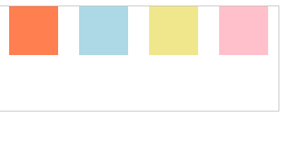
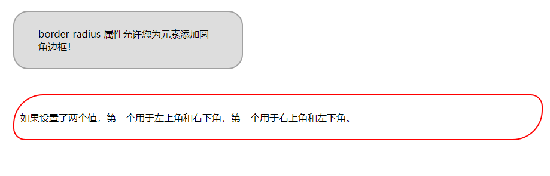
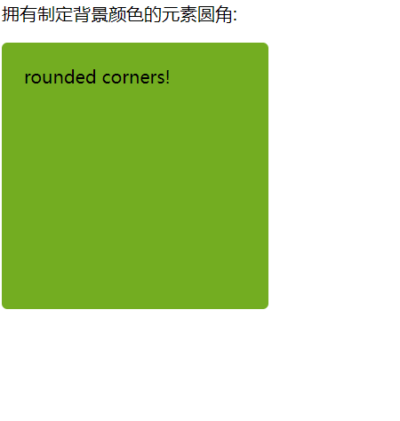

# 知识点总结


容器

## 弹性布局

### 简介

网页布局是css的一个重点应用


布局的传统解决方案，基于盒状模型，依赖 display 属性 + position属性 + float属性。它对于那些特殊布局非常不方便，比如，垂直居中就不容易实现。

2009年，W3C 提出了一种新的方案----Flex 布局，可以简便、完整、响应式地实现各种页面布局。目前，它已经得到了所有浏览器的支持，这意味着，现在就能很安全地使用这项功能。


### Flex布局是什么?

flex 是flexble box 的缩写,意思是弹性布局,用来为盒装模型提供最大的灵活性


任何一个容器都可以指定为flex布局

```css
.box{
  display: flex;
}
```


比如项目中用到的

```css
.wrapper header{
    width: 100%;
    height: 12vw;
    background-color: #0097ff;

    display: flex;
    align-items: center;
}
```


##  align-items

align的中文意思是对齐

例子:

```css
#居中对齐弹性盒的各项 <div> 元素：

div
{
    display: flex;
    align-items:center;
}

```


属性值

| 值         | 描述                                                         |
| :--------- | :----------------------------------------------------------- |
| stretch    | 默认值。元素被拉伸以适应容器。如果指定侧轴大小的属性值为'auto'，则其值会使项目的边距盒的尺寸尽可能接近所在行的尺寸，但同时会遵照'min/max-width/height'属性的限制。 |
| center     | 元素位于容器的中心。弹性盒子元素在该行的侧轴（纵轴）上居中放置。（如果该行的尺寸小于弹性盒子元素的尺寸，则会向两个方向溢出相同的长度）。 |
| flex-start | 元素位于容器的开头。弹性盒子元素的侧轴（纵轴）起始位置的边界紧靠住该行的侧轴起始边界。 |
| flex-end   | 元素位于容器的结尾。弹性盒子元素的侧轴（纵轴）起始位置的边界紧靠住该行的侧轴结束边界。 |
| baseline   | 元素位于容器的基线上。如弹性盒子元素的行内轴与侧轴为同一条，则该值与'flex-start'等效。其它情况下，该值将参与基线对齐。 |
| initial    | 设置该属性为它的默认值。                                     |
| inherit    | 从父元素继承该属性。                                         |


## margin

margin属性为给定元素设置所有四个(上下左右)方向的外边距属性


例如

```css
/*设置p元素的4个外边距*/
p
  {
  margin:2cm 4cm 3cm 4cm;
  }
```


例子 1

```
margin:10px 5px 15px 20px;
```

- 上外边距是 10px
- 右外边距是 5px
- 下外边距是 15px
- 左外边距是 20px

例子 2

```
margin:10px 5px 15px;
```

- 上外边距是 10px
- 右外边距和左外边距是 5px
- 下外边距是 15px

例子 3

```
margin:10px 5px;
```

- 上外边距和下外边距是 10px
- 右外边距和左外边距是 5px

例子 4

```
margin:10px;
```

- 所有 4 个外边距都是 10px


## justify-content属性

本项目中出现:justify-content: center;


作用是:justify-content 用于设置或检索弹性盒子元素在主轴（横轴）方向上的对齐方式。


```css
<!DOCTYPE html>
<html>
<head>
<meta charset="utf-8">
<title>justify-content</title>
<style>
#main {
    width: 400px;
    height: 150px;
    border: 1px solid #c3c3c3;
    display: -webkit-flex; /* Safari */
    -webkit-justify-content: space-around; /* Safari 6.1+ */
    display: flex;
    justify-content: space-around;
}

#main div {
    width: 70px;
    height: 70px;
}
</style>
</head>
<body>

<div id="main">
  <div style="background-color:coral;"></div>
  <div style="background-color:lightblue;"></div>
  <div style="background-color:khaki;"></div>
  <div style="background-color:pink;"></div>
</div>


</body>
</html>
```


执行结果:





## border-radius属性

本项目中出现:border-radius: 2px;

css里就是通过这个border-radius属性来实现任何元素的圆角样式

 ````css
 <meta charset="utf-8"> 
 <title>radius属性</title> 
 <style> 
 #example1
 {
 	border:2px solid #a1a1a1;
 	padding:10px 40px; 
 	background:#dddddd;
 	width:300px;
 	border-radius:25px;
 }
 #example2 {
   border: 2px solid red;
   padding: 10px;
   border-radius: 50px 20px;
 }
 </style>
 </head>
 <body>
 <div id="example1">
   <p>border-radius 属性允许您为元素添加圆角边框！</p>
 </div>
 <br><br>
 <div id="example2">
   <p>如果设置了两个值，第一个用于左上角和右下角，第二个用于右上角和左下角。</p>
 </div>
 </body>
 </html>
 ````


运行结果:




例子2

```css
<!DOCTYPE html>
<html lang="en">
<head>
    <meta charset="UTF-8">
    <meta http-equiv="X-UA-Compatible" content="IE=edge">
    <meta name="viewport" content="width=device-width, initial-scale=1.0">
    <title>圆角</title>
</head>
<body>

    <style>
        #r1{
            border-radius: 5px;
            background:#73AD21;
            padding: 20px;
            width: 200px;
            height: 200px;
        }

    </style>

<p>拥有制定背景颜色的元素圆角:</p>
<p id="r1">rounded corners!</p>


    
</body>
</html>
```

结果:




## 参考资料

[border-radius](https://developer.mozilla.org/zh-CN/docs/Web/CSS/border-radius)

[CSS 弹性盒子布局](https://developer.mozilla.org/zh-CN/docs/Web/CSS/CSS_Flexible_Box_Layout)

[CSS justify-content 属性](https://www.runoob.com/cssref/css3-pr-justify-content.html)

[Flex 布局教程：语法篇](https://www.ruanyifeng.com/blog/2015/07/flex-grammar.html)